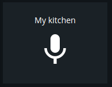
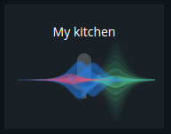
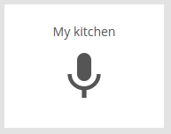

# Announcement

Modulename: announce

## Description

A module used for announcing messages on a [Sonos](http://www.sonos.com) home sound system.
Press the button for this module and speak the phrase you want announced and the system will play the sound clip in the selected room.
Due to web browser restrictions you have to run this dashboard over the HTTPS protocol to be able to access the microphone!

## Config

    {
        module: "announce",
        config: {
          title:    <string>,  // title of the module that should be shown on the dashboard
          path:     <string>,  // filesystem path on server where temporary sound clips should be stored
          url:      <string>,  // URL to Sonos REST API
          volume:   <number>,  // volume of played announcement in percentage (0-100)
          room:     <string>,  // name of room where announcement should be played, this should match the room name of your Sonos system. "all" for every room.
          section:  <string>,  // which section this modules should be displayed on
          column:   <number>,  // at what column on the section should this module be displayed at, higher value = more to the right of the screen
          row:      <number>,  // at what row on the section should this module be displayed at, higher value = more to the bottom of the screen
          size_x: 1, <number>  // width of module, in number of columns <optional>
          size_y: 2  <number>  // height of module, in number of rows <optional>
        }
    }

### Config example

    {
        module: "announce",
        config: {
          title: 'My kitchen',
          path: '/tmp',
          url: 'http://192.168.0.39:5005',
          volume: 80,
          room: 'kitchen',
          section: "start",
          column: 1,
          row: 6
        }
    }

## Screenshots

 &nbsp;  &nbsp; 

## Author

Emil Öhman
