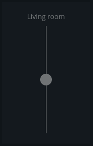
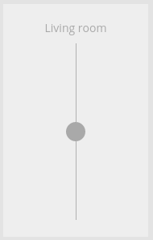

# Dimmer

Modulename: dimmer


## Description

Dimmer that could be used to fade lights or variable control other devices.
Because of the large diversity of devices and Home Automation systems on the market, the configuration of a dimmer could be a bit technical, not all settings may be needed for YOUR configuration. Please read the "Config" and "Config example" sections below.

### stateParseExpression-property
Especially the __stateParseExpression__ property may need further explaination. If the hardware device we are controlling are reporting back a simple value like "1", "255" or "on" for representing an active device then we should leave the __stateParseExpression__ setting empty. However if the device returns a more complex JSON-object then we need to specify an XPath expression to help the dimmer to parse out the value representing the state of the dimmer.
E.g. if a JSON-object like this is returned from a device:

```
{
    "id": "device 123",
    "values": [
        {
            "val": 50
        },
        {
            "val": 0
        }
    ],
    "lastChange": "2018-01-01 11:22:00" 
}
```
Then a XPath-expression like this could be specified as __stateParseExpression__ to get the value of the first "val" in this fictional example:

``
"//@val[1]"
``

Use this [interactive editor](http://dragonworx.github.io/jsel/) to experiment and build your own expressions.

## Config

    {
        module: "dimmer",
        config: {
            title:     <string>,  // title of the module that should be shown on the dashboard
            plugin:    <string>,  // plugin to use with this module
            id:        <string>,  // identifier that uniquely indentifies this module to the plugin
	        readonly:  <boolean>, // the dimmer can not be modified
            type:      <string>,  // type of dimmer, "slider" or "knob"
            setTopic:  <string>,  // MQTT topic that should be used to set the level of the dimmer
            getTopic:  <string>,  // MQTT topic that should be used to get the current level of the dimmer
            statusTopic: <string>,// MQTT topic the dimmer use to report back state changes
            stateParseExpression: <string>, // XPath expression for parsing the state from an JSON-object, if not set then we expect the returned state be a simple datatype as string or number.
            levelCmd:  <string>,  // command that should be sent to the "setTopic"-topic for changing the level of the dimmer
            maxLevel:  <number>,  // value that represent te highest value the dimmer can take (fully on)
            minLevel:  <number>,  // value that represent te lowest value the dimmer can take (fully off)
            column:    <number>,  // at what column on the section should this module be displayed at, higher value = more to the right of the screen
            row:       <number>,  // at what row on the section should this module be displayed at, higher value = more to the bottom of the screen
            size_x: 1, <number>  // width of module, in number of columns <optional>
            size_y: 2  <number>  // height of module, in number of rows <optional>
        }
    }


### Config example

    {
        module: "dimmer",
        config: {
            title: "Wardrobe light",
            plugin: "mqtt",
            id: "1",
            readonly: false,
            type: "knob",
            setTopic: "home/entrance-wardrobe/setlightlevel",
            getTopic: "home/entrance-wardrobe/getlightlevel",
            statusTopic: "home/entrance-wardrobe/lightlevel",
            levelCmd: '{"level": <level>}',
            maxLevel: 100,
            minLevel: 0,
            column: 2,
            row: 1,
            size_x: 1,
            size_y: 1
        }
    }

## Screenshots

 &nbsp; 


## Author

    Henrik Östman
