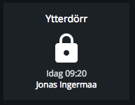
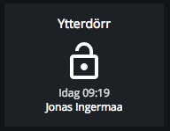
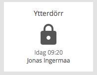
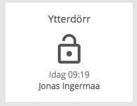

# <TBD>

Modulename: doorlock

## Description

A module used for viewing current doorlock status from digital doorlock.

## Config

    {
        module: "doorlock",
        config: {
            title:     <string>,    // title of the module that should be shown on the dashboard
            plugin:    <string>,    // plugin used for this modules
            alias:     <string>,    // name of the alias for the location of the lock 
            area:      <string>,    // name of the area for the location of the lock 
            section:   <string>,    // which section this modules should be displayed on
            column:    <number>,    // at what column on the section should this module be displayed at, higher value = more to the right of the screen
            row:       <number>,    // at what row on the section should this module be displayed at, higher value = more to the bottom of the screen
            size_x: 1  <number>,    // width of module, in number of columns <optional>
            size_y: 2  <number>     // height of module, in number of rows <optional>
        }
    }

### Config example

    {
        module: "doorlock",
        config: {
          title: "Ytterdörr",
          plugin: "verisure",
          alias: "Kodarvägen",
          area: "Entre",
          section: "start",
          column: 1,
          row: 1,
          size_x: 1,
          size_y: 1
        }
    }

## Screenshots

 &nbsp;  &nbsp;  &nbsp;  

## Author

    Jonas Ingermaa
