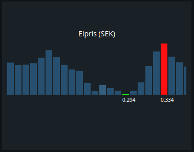
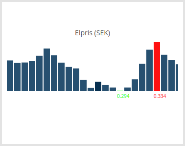

# Electricity spot price module

Modulename: electricity-spot-price

## Description

This module visualizes the current electricity pricing during the 24 hours of a day. It shows when the electricity is the highest and the lowest during the day with the actual price per KWh below the graph. This could be useful when planning your power consumption over a day when you have a non fixed fixed power subscription.

## Config

    {
        module: "electricity-spot-price",
        config: {
          title:     <string>,  // title of the module that should be shown on the dashboard
          plugin:    <string>,  // plugin to use with this module
          section:   <string>,  // which section this module should be displayed on
          column:    <number>,  // at what column on the section should this module be displayed at, higher value = more to the right of the screen
          row:       <number>,  // at what row on the section should this module be displayed at, higher value = more to the bottom of the screen
          size_x:    <number>,  // width of module, in number of columns <optional>
          size_y:    <number>   // height of module, in number of rows <optional>
        }
    }

### Config example

    {
    	module: "electricity-spot-price",
        config: {
          title: "Elpris (SEK)",
          plugin: "electricity-spot-price",
          section: "start",
          column: 1,
          row: 5,
          size_x: 2,
          size_y: 2
        }
    }

## Screenshots

 &nbsp; 

## Author

    Henrik Östman
