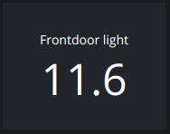
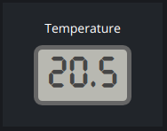
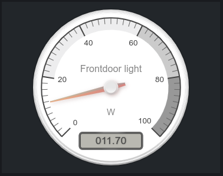
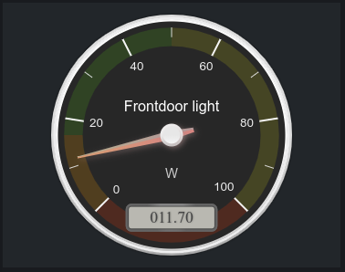
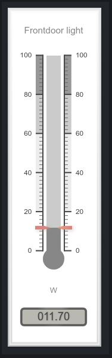

# Gauge

Modulename: gauge

## Description

Generic gauge module to visualize a value/reading from a sensor or some kind of device.
The gauge support visualizing the value in several formats:

- Plain textual representation
- LCD box, similar to "text" but with a more digial touch
- Radial meter-like representation
- Linear termometer-like representation

## Config

    {
        module: "gauge",
        config: {
            title:     <string>,  // title of the module that should be shown on the dashboard
            plugin:    <string>,  // plugin to use with this module
            id:        <string>,  // identifier that uniquely indentifies this module to the plugin
            type:      <string>,  // type of gauge, "text", "lcd", "radial-gauge" or "linear-gauge"
            gaugeConfig: <object>,// additional configuration for the specific gauge-type. For radial and linear-gauge see this page: https://canvas-gauges.com/documentation/user-guide/configuration.
            getTopic:  <string>,  // MQTT topic that should be used to get the current value of the gauge
            statusTopic: <string>,// MQTT topic the gauge use to report back state changes
            stateParseExpression: <string>, // XPath expression for parsing the state from an JSON-object, if not set then we expect the returned state be a simple datatype as string or number.
            section:   <string>,  // which section this modules should be displayed on
            column:    <number>,  // at what column on the section should this module be displayed at, higher value = more to the right of the screen
            row:       <number>,  // at what row on the section should this module be displayed at, higher value = more to the bottom of the screen
            size_x: 1, <number>  // width of module, in number of columns <optional>
            size_y: 2  <number>  // height of module, in number of rows <optional>
        }
    }

### Config example

Text Gauge

    {
      module: "gauge",
      config: {
        title: "Frontdoor light",
        plugin: "mqtt",
        id: "doorlight-power2",
        type: "text",
        statusTopic: "home/zwave/node/7/power_change",
        stateParseExpression: "//value/@value",
        section: "lights",
        size_x: 1,
        size_y: 1,
        column: 4,
        row: 1
      }
    }

LCD Gauge

    {
      module: "gauge",
      config: {
        title: "Frontdoor light",
        plugin: "mqtt",
        id: "doorlight-power2",
        type: "lcd",
        statusTopic: "home/zwave/node/7/power_change",
        stateParseExpression: "//value/@value",
        section: "lights",
        size_x: 1,
        size_y: 1,
        column: 4,
        row: 2
      }
    }    

Radial Gauge

    {
      module: "gauge",
      config: {
        title: "Frontdoor light",
        plugin: "mqtt",
        id: "doorlight-power",
        type: "radial-gauge",
        gaugeConfig: {
          units: 'W',
          minValue: 0,
          maxValue: 100,
          valueBox: true
        },
        statusTopic: "home/zwave/node/7/power_change",
        stateParseExpression: "//value/@value",
        section: "lights",
        size_x: 3,
        size_y: 3,
        column: 1,
        row: 2
      }
    }

Radial Gauge - Advanced

    {
      module: "gauge",
      config: {
        title: "Frontdoor light",
        plugin: "mqtt",
        id: "doorlight-power",
        type: "radial-gauge",
        gaugeConfig: {
          units: 'W',
          value: 0,
          minValue: 0,
          maxValue: 100,
          majorTicks: [
              '0','20','40','60','80','100'
          ],
          minorTicks: 2,
          strokeTicks: false,
          highlights: [
              { from: 0, to: 50, color: 'rgba(0,255,0,.15)' },
              { from: 50, to: 100, color: 'rgba(255,255,0,.15)' },
              { from: 100, to: 150, color: 'rgba(255,30,0,.25)' },
          ],
          colorPlate: '#222',
          colorMajorTicks: '#f5f5f5',
          colorMinorTicks: '#ddd',
          colorTitle: '#fff',
          colorUnits: '#ccc',
          colorNumbers: '#eee',
          colorNeedle: 'rgba(240, 128, 128, 1)',
          colorNeedleEnd: 'rgba(255, 160, 122, .9)',
          fontValue: 'LCD',
          valueBox: true,
          animationRule: 'bounce',
          animationDuration: 500
        },
        statusTopic: "home/zwave/node/7/power_change",
        stateParseExpression: "//value/@value",
        section: "lights",
        size_x: 2,
        size_y: 2,
        column: 1,
        row: 2
      }
    }

Linear Gauge

    {
      module: "gauge",
      config: {
        title: "Frontdoor light",
        plugin: "mqtt",
        id: "doorlight-power2",
        type: "linear-gauge",
        gaugeConfig: {
          units: 'W',
          minValue: 0,
          maxValue: 100,
          valueBox: true
        },
        statusTopic: "home/zwave/node/7/power_change",
        stateParseExpression: "//value/@value",
        section: "lights",
        size_x: 1,
        size_y: 5,
        column: 4,
        row: 1
      }
    }

## Screenshots

 &nbsp; &nbsp; &nbsp;

## Author

    Henrik Östman
