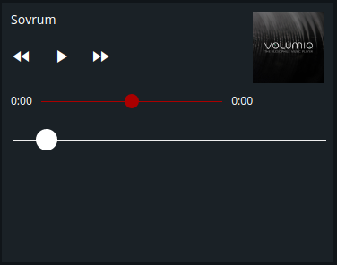
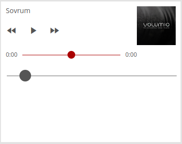

# Mediaplayer

Modulename: mediaplayer

## Description

Module to control mediaplayer devices, like [Sonos](https://www.sonos.com) or [Volumio](https://volumio.org/).

## Config

    {
        module: "mediaplayer",
        config: {
          title:    <string>,  // title of the module that should be shown on the dashboard
          plugin:   <string>,  // plugin to use with this module
          devicename: <string>,// unique identifier for device, this could be a name or a URL.
          column:   <number>,  // at what column on the section should this module be displayed at, higher value = more to the right of the screen
          row:      <number>,  // at what row on the section should this module be displayed at, higher value = more to the bottom of the screen
          size_x: 1, <number>  // width of module, in number of columns <optional>
          size_y: 2  <number>  // height of module, in number of rows <optional>
        }
    }

### Config example

      {
        module: "mediaplayer",
        config: {
          title: "Kitchen speaker",
          plugin: "sonos",
          devicename: "Kitchen",
          column: 1,
          row: 1,
          size_x: 2,
          size_y: 2
        }
      }

      {
        module: "mediaplayer",
        config: {
          title: "Bedroom",
          plugin: "volumio",
          devicename: "http://volumio.local:3000",
          column: 3,
          row: 1,
          size_x: 2,
          size_y: 2
        }
      }

## Screenshots

 &nbsp; 

## Author

    Emil Öhman
