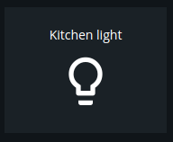
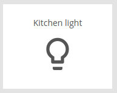

# Switch

Modulename: switch


## Description

Generic switch that could be used to switch lights and other things on and off.
Several options are available for customizing the look and functionality of the switch.
Because of the large diversity of devices and Home Automation systems on the market, the configuration of a switch could be a bit technical, not all settings may be needed for YOUR configuration. Please read the "Config" and "Config example" sections below.

### stateParseExpression-property
Especially the __stateParseExpression__ property may need further explaination. If the hardware device we are controlling are reporting back a simple value like "1", "255" or "on" for representing an active device then we should leave the __stateParseExpression__ setting empty. However if the device returns a more complex JSON-object then we need to specify an XPath expression to help the switch to parse out the value representing the state of the switch.
E.g. if a JSON-object like this is returned from a device:

```
{
    "id": "device 123",
    "values": [
        {
            "val": 1
        },
        {
            "val": 0
        }
    ],
    "lastChange": "2018-01-01 11:22:00" 
}
```
Then a XPath-expression like this could be specified as __stateParseExpression__ to get the value of the first "val" in this fictional example:

``
"//@val[1]"
``

Use this [interactive editor](http://dragonworx.github.io/jsel/) to experiment and build your own expressions.

## Config

    {
        module: "switch",
        config: {
          title:     <string>,  // title of the module that should be shown on the dashboard
          plugin:    <string>,  // plugin to use with this module
	      id:        <string>,  // identifier that uniquely indentifies this module to the plugin
	      readonly:  <boolean>, // the switch can not be modified
          type:      <string>,  // type of switch, "button" or "button momentary" (turns off as soon as you release the button)
          setTopic:  <string>,  // Topic that should be used to set the switch to a new state
          getTopic:  <string>,  // Topic that should be used to request the current state of the switch
          statusTopic: <string>,// Topic the switch use to report back state changes
          stateParseExpression: <string>, // XPath expression for parsing the state from an JSON-object, if not set then we expect the returned state be a simple datatype as string or number.
          onCmd:     <string>,  // command that should be sent to the "setTopic"-topic for turning the switch on
          offCmd:    <string>,  // command that should be sent to the "setTopic"-topic for turning the switch off
          icon_on:   <string>,  // icon for switch when active
          icon_off:  <string>,  // icon for switch when inactive
          column:    <number>,  // at what column on the section should this module be displayed at, higher value = more to the right of the screen
          row:       <number>,  // at what row on the section should this module be displayed at, higher value = more to the bottom of the screen
          size_x: 1, <number>  // width of module, in number of columns <optional>
          size_y: 2  <number>  // height of module, in number of rows <optional>
        }
    }


### Config example

    {
        module: "switch",
        config: {
          title: "Kitchen light",
          plugin: "mqtt",
          id: "1",
          readonly: false,
          type: "button",
          setTopic: "home/kitchen/setlightlevel",
          getTopic: "home/kitchen/getlightlevel",
          statusTopic: "home/kitchen/lightlevel",
          onCmd: '{"level": 100}',
          offCmd: '{"level": 0}',
          column: 2,
          row: 1,
          size_x: 1,
          size_y: 1
        }
    }

    {
        module: "switch",
        config: {
          title: "Lamppost",
          plugin: "mqtt",
          id: "lamppost2",
          readonly: false,
          type: "button",
          icon_on: 'lightbulb',
          icon_off: 'lightbulb_outline',
          setTopic: "home/zwave/command",
          getTopic: "",
          statusTopic: "home/zwave/node/7/value_change",
          onCmd: '{"nodeid":7,"cmdclass":37,"cmdidx":0,"value":true}',
          offCmd: '{"nodeid":7,"cmdclass":37,"cmdidx":0,"value":false}',
          stateParseExpression: "//@val[1]", 
          column: 2,
          row: 2
        }
    }

## Screenshots

 &nbsp;


## Author

    Emil Öhman, Henrik Östman
