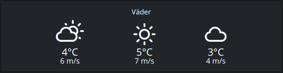
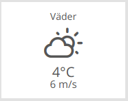

# Weather

Modulename: weather-current

## Description

Displays weather forcasts based upon the dashboards position (latitude/longitude).
The width of the module specifies how many days forecast to be displayed.

    size_x = 1: gives current weather
    size_x = 2: gives current weather and next days weather
    and so forth...

## Config

    {
        module: "weather-current",
        config: {
          title:    <string>,  // title of the module that should be shown on the dashboard
          plugin:   <string>,  // plugin to use with this module
          lat:      <string>,  // latitude of dashboard location
          lon:      <string>,  // longitude of dashboard location
          column:   <number>,  // at what column on the section should this module be displayed at, higher value = more to the right of the screen
          row:      <number>,  // at what row on the section should this module be displayed at, higher value = more to the bottom of the screen
          size_x: 1, <number>  // width of module, in number of columns <optional>
          size_y: 2  <number>  // height of module, in number of rows <optional>
        }
    }

### Config example

      {
        module: "weather-current",
        config: {
          title: "Visby",
          plugin: "smhi",
          lat: "57.634800",
          lon: "18.294840",
          column: 3,
          row: 1,
          size_x: 1,
          size_y: 1
        }
      }

## Screenshots

 &nbsp; 

## Author

    Emil Öhman
